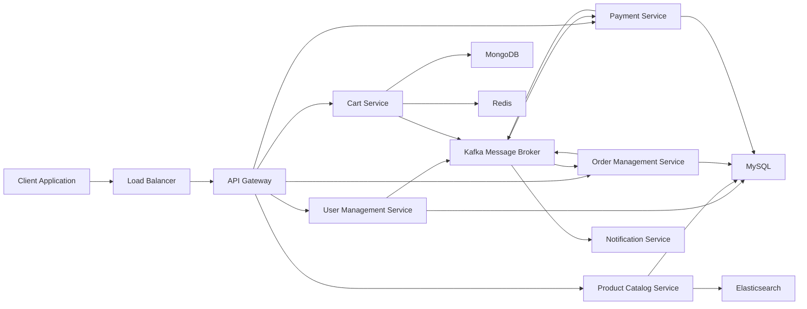
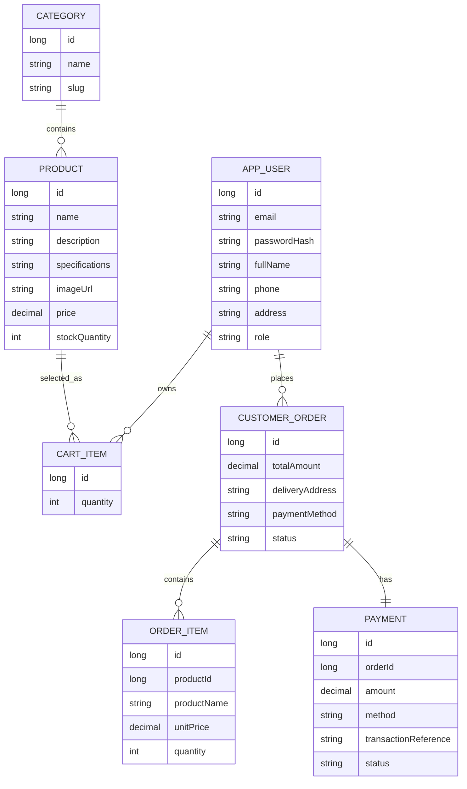
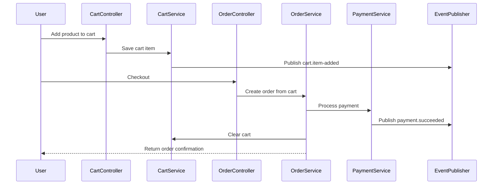

# Project Report: Ecommerce Microservices Backend Using Spring Boot

## 1. Title

**Ecommerce Microservices Backend Using Spring Boot, JWT Authentication, Kafka-Ready Events, MySQL, Redis, MongoDB, and Elasticsearch**

## 2. Abstract

This project implements the backend foundation for an ecommerce website based on a high-level microservices design. The system supports core ecommerce workflows such as user registration, login, profile management, product browsing, product search, cart management, checkout, order history, order tracking, and payment receipt generation.

The implementation is built using Spring Boot and follows a modular architecture. Each domain area is separated into packages that represent the intended microservices: User Management, Product Catalog, Cart, Order Management, Payment, and Notification/Event handling. For development convenience, the current project runs as a modular monolith, while the internal structure keeps service boundaries clear enough to evolve into independently deployable microservices.

The application uses Spring Security with JWT-based authentication, Spring Data JPA for persistence, H2 for local development, MySQL profile support for production-style relational storage, and Docker Compose definitions for supporting infrastructure such as MySQL, Kafka, Redis, MongoDB, and Elasticsearch. Domain events are published through an abstraction that currently logs events and can later be connected to Kafka.

## 3. Introduction

Modern ecommerce systems must support secure user access, fast product discovery, reliable cart and checkout flows, order tracking, and payment processing. These requirements are usually handled by multiple backend services that communicate synchronously through APIs and asynchronously through a message broker.

This project demonstrates the backend design of such a system. It focuses on clean domain separation, RESTful API design, secure authentication, database-backed persistence, and event-driven readiness. The implementation provides a working baseline that can be tested locally and expanded into a full production-grade microservices platform.

## 4. Problem Statement

The objective is to build a backend system for an ecommerce website that allows users to:

- Create and manage accounts.
- Securely log in and access protected resources.
- Browse and search products.
- Add products to a shopping cart.
- Review cart totals.
- Place orders through checkout.
- Track order status.
- Receive payment receipts.

The system should also be designed with scalability and extensibility in mind, using architectural components such as an API Gateway, databases, caching, Kafka, and Elasticsearch.

## 5. Project Objectives

The main objectives of the project are:

- Implement secure user registration and login.
- Use JWT tokens for stateless authentication.
- Provide REST APIs for catalog, cart, order, and payment workflows.
- Model ecommerce entities such as users, categories, products, cart items, orders, order items, and payments.
- Keep service boundaries aligned with the provided high-level microservices design.
- Provide local development support using H2.
- Provide infrastructure definitions using Docker Compose.
- Keep the codebase extensible for future Kafka, Redis, MongoDB, and Elasticsearch integrations.

## 6. Scope of the Project

### 6.1 In Scope

- Backend REST API implementation.
- JWT-based authentication and authorization.
- User profile management.
- Product catalog browsing and keyword search.
- Cart add, update, remove, and review operations.
- Checkout and order creation.
- Payment record creation and receipt generation.
- Basic order tracking.
- Sample product data seeding.
- Docker Compose setup for supporting infrastructure.
- Maven-based build and test setup.

### 6.2 Out of Scope

- Frontend web or mobile application.
- Real third-party payment gateway integration.
- Real email or SMS notification delivery.
- Production API Gateway configuration.
- Full independent deployment of each microservice.
- Advanced inventory reservation and refund workflows.

## 7. Technology Stack

| Layer | Technology |
|---|---|
| Programming Language | Java 17 |
| Backend Framework | Spring Boot 3.3.5 |
| REST API | Spring Web |
| Security | Spring Security, JWT |
| Persistence | Spring Data JPA |
| Local Database | H2 |
| Production Database Option | MySQL |
| Messaging Readiness | Spring Kafka dependency and domain event abstraction |
| Build Tool | Maven |
| Testing | JUnit, Spring Boot Test |
| Infrastructure | Docker Compose |
| Planned Cache | Redis |
| Planned Document Store | MongoDB |
| Planned Search Engine | Elasticsearch |

## 8. System Architecture

The project follows the high-level architecture described in the PRD/HLD. In a production deployment, external traffic would pass through a load balancer and API Gateway before reaching independently deployed microservices.



## 9. Implementation Architecture

The submitted repository currently implements the backend as a modular Spring Boot application. This gives a working system while preserving microservice boundaries through packages.

| Package | Responsibility |
|---|---|
| `com.example.ecommerce.user` | Registration, login, profile management, password reset token generation |
| `com.example.ecommerce.catalog` | Product category, product details, browsing, keyword search |
| `com.example.ecommerce.cart` | Cart item management and cart total calculation |
| `com.example.ecommerce.order` | Checkout, order creation, order history, order tracking |
| `com.example.ecommerce.payment` | Payment record creation and receipt generation |
| `com.example.ecommerce.common.security` | JWT generation, JWT validation, security filter, security configuration |
| `com.example.ecommerce.common.events` | Domain event publishing abstraction |
| `com.example.ecommerce.common.api` | Central API exception handling |
| `com.example.ecommerce.config` | Sample data seeding |

This design can be migrated into true microservices by extracting each package into a separate Spring Boot application and replacing direct service calls with REST, Kafka, or gRPC communication.

## 10. Functional Requirements Mapping

| Requirement | Implementation Status | Relevant Module |
|---|---|---|
| User registration | Implemented | `user` |
| User login | Implemented | `user`, `common.security` |
| Profile management | Implemented | `user` |
| Password reset | Token generation implemented | `user` |
| Product browsing | Implemented | `catalog` |
| Product details | Implemented | `catalog` |
| Product search | Implemented using database keyword search; Elasticsearch-ready | `catalog` |
| Add to cart | Implemented | `cart` |
| Cart review | Implemented | `cart` |
| Checkout | Implemented | `order`, `payment` |
| Order confirmation | Implemented through checkout response | `order` |
| Order history | Implemented | `order` |
| Order tracking | Implemented | `order` |
| Multiple payment options | Payment method field supported | `payment`, `order` |
| Secure transactions | Simulated payment record; real gateway pending | `payment` |
| Payment receipt | Implemented | `payment` |
| Secure authentication | Implemented using JWT | `common.security` |
| Session management | Stateless bearer token expiration | `common.security` |

## 11. Database Design

The current implementation uses JPA entities and can run with H2 or MySQL. The major entities are:

### 11.1 User Entity

Stores user identity and profile information.

Fields include:

- `id`
- `email`
- `passwordHash`
- `fullName`
- `phone`
- `address`
- `role`
- `createdAt`

### 11.2 Category Entity

Stores product category details.

Fields include:

- `id`
- `name`
- `slug`

### 11.3 Product Entity

Stores product information.

Fields include:

- `id`
- `name`
- `description`
- `specifications`
- `imageUrl`
- `price`
- `stockQuantity`
- `category`

### 11.4 Cart Item Entity

Stores products selected by a user before checkout.

Fields include:

- `id`
- `user`
- `product`
- `quantity`

### 11.5 Customer Order Entity

Stores order-level information.

Fields include:

- `id`
- `user`
- `items`
- `totalAmount`
- `deliveryAddress`
- `paymentMethod`
- `status`
- `createdAt`

### 11.6 Order Item Entity

Stores product snapshots inside an order.

Fields include:

- `id`
- `order`
- `productId`
- `productName`
- `unitPrice`
- `quantity`

### 11.7 Payment Entity

Stores payment transaction information.

Fields include:

- `id`
- `orderId`
- `amount`
- `method`
- `transactionReference`
- `status`
- `paidAt`

## 12. Entity Relationship Overview



## 13. Module Descriptions

### 13.1 User Management Module

The User Management module handles user registration, login, profile retrieval, profile update, and password reset token generation. Passwords are stored as BCrypt hashes. Login returns a JWT token that is used to authenticate future requests.

Important classes:

- `AppUser`
- `UserRepository`
- `UserService`
- `AuthController`
- `UserController`

### 13.2 Security Module

The security module uses Spring Security and JWT. Public endpoints include registration, login, password reset, and product browsing. Cart, order, payment, and profile operations require an authenticated bearer token.

Important classes:

- `SecurityConfig`
- `JwtService`
- `JwtAuthenticationFilter`
- `CurrentUser`

### 13.3 Product Catalog Module

The catalog module manages product categories and product details. It supports listing all products, filtering by category, retrieving product details by ID, and searching by keyword.

Important classes:

- `Category`
- `Product`
- `CategoryRepository`
- `ProductRepository`
- `CatalogService`
- `CatalogController`

### 13.4 Cart Module

The cart module allows authenticated users to add products, update quantities, remove products, and view cart totals. Cart totals are calculated dynamically using product price and quantity.

Important classes:

- `CartItem`
- `CartItemRepository`
- `CartService`
- `CartController`

### 13.5 Order Management Module

The order module handles checkout, order creation, order history, and order tracking. During checkout, cart items are converted into order items, the total is calculated, payment is processed, and the cart is cleared.

Important classes:

- `CustomerOrder`
- `OrderItem`
- `OrderStatus`
- `OrderRepository`
- `OrderService`
- `OrderController`

### 13.6 Payment Module

The payment module records payment information and generates a receipt. The current implementation simulates successful payment and creates a transaction reference.

Important classes:

- `Payment`
- `PaymentStatus`
- `PaymentRepository`
- `PaymentService`
- `PaymentController`

### 13.7 Event Module

The event module provides an abstraction for publishing domain events. Currently, events are logged. In a full microservices deployment, this abstraction can be implemented using Kafka.

Important classes:

- `DomainEventPublisher`
- `LoggingDomainEventPublisher`

## 14. API Documentation

### 14.1 Authentication APIs

| Method | Endpoint | Description | Auth Required |
|---|---|---|---|
| POST | `/api/auth/register` | Register a new user | No |
| POST | `/api/auth/login` | Authenticate user and return JWT | No |

### 14.2 User APIs

| Method | Endpoint | Description | Auth Required |
|---|---|---|---|
| GET | `/api/users/me` | Get current user profile | Yes |
| PUT | `/api/users/me` | Update current user profile | Yes |
| POST | `/api/users/password-reset` | Generate password reset token | No |

### 14.3 Catalog APIs

| Method | Endpoint | Description | Auth Required |
|---|---|---|---|
| GET | `/api/categories` | List product categories | No |
| GET | `/api/products` | List all products or filter by category | No |
| GET | `/api/products/search?q=phone` | Search products by keyword | No |
| GET | `/api/products/{id}` | Get product details | No |

### 14.4 Cart APIs

| Method | Endpoint | Description | Auth Required |
|---|---|---|---|
| GET | `/api/cart` | View current user's cart | Yes |
| POST | `/api/cart/items` | Add item to cart | Yes |
| PUT | `/api/cart/items/{productId}` | Update item quantity | Yes |
| DELETE | `/api/cart/items/{productId}` | Remove item from cart | Yes |

### 14.5 Order APIs

| Method | Endpoint | Description | Auth Required |
|---|---|---|---|
| POST | `/api/orders/checkout` | Place order from cart | Yes |
| GET | `/api/orders` | View order history | Yes |
| GET | `/api/orders/{orderId}/tracking` | Track order status | Yes |

### 14.6 Payment APIs

| Method | Endpoint | Description | Auth Required |
|---|---|---|---|
| GET | `/api/payments/{paymentId}/receipt` | Get payment receipt | Yes |

## 15. Sample API Flow

### 15.1 User Registration and Login

1. User registers through `/api/auth/register`.
2. The backend validates email and password.
3. Password is hashed using BCrypt.
4. User record is saved.
5. JWT token is returned.

### 15.2 Product Search

1. User calls `/api/products/search?q=watch`.
2. Product Catalog module searches product name and description.
3. Matching products are returned.
4. In future, Elasticsearch can replace or enhance database keyword search.

### 15.3 Cart and Checkout

1. User adds products through `/api/cart/items`.
2. Cart module stores selected product and quantity.
3. User reviews cart through `/api/cart`.
4. User checks out through `/api/orders/checkout`.
5. Order module creates an order and order items.
6. Payment module creates a payment record.
7. Cart is cleared.
8. Order confirmation is returned.

## 16. Checkout Sequence



## 17. Security Design

The project uses stateless JWT authentication.

Security features include:

- BCrypt password hashing.
- JWT token generation after login and registration.
- JWT validation through a Spring Security filter.
- Stateless session configuration.
- Protected user, cart, order, and payment APIs.
- Public product browsing APIs.
- Centralized error handling for API failures.

The JWT contains the user email as the subject and expires based on the configured application property.

## 18. Configuration

The main configuration file is:

```text
src/main/resources/application.yml
```

Default configuration:

- Uses H2 in-memory database.
- Enables H2 console.
- Uses JPA automatic schema update.
- Runs on port `8080`.
- Configures JWT issuer, secret, and expiration.

MySQL profile:

- Can be activated using the `mysql` Spring profile.
- Uses MySQL database connection details from `application.yml`.

## 19. Infrastructure Design

The project includes `docker-compose.yml` for local infrastructure services:

- MySQL
- Redis
- MongoDB
- Zookeeper
- Kafka
- Elasticsearch

Although the current application uses H2 by default, these services represent the intended production architecture and can be integrated as the project evolves.

## 20. Testing

The project includes a Spring Boot context load test:

```text
src/test/java/com/example/ecommerce/EcommerceBackendApplicationTests.java
```

The test validates that the application context starts successfully with the configured beans, repositories, services, controllers, security configuration, and database setup.

The project was verified using:

```bash
mvn test
```

Result:

```text
BUILD SUCCESS
Tests run: 1, Failures: 0, Errors: 0, Skipped: 0
```

## 21. How to Run the Project

### 21.1 Prerequisites

- Java 17 or above
- Maven
- Git

### 21.2 Run with H2

```bash
mvn spring-boot:run
```

Application URL:

```text
http://localhost:8080
```

API base URL:

```text
http://localhost:8080/api
```

H2 console:

```text
http://localhost:8080/h2-console
```

### 21.3 Run Supporting Infrastructure

```bash
docker compose up -d
```

### 21.4 Run with MySQL Profile

```bash
mvn spring-boot:run -Dspring-boot.run.profiles=mysql
```

## 22. GitHub Repository

Repository URL:

```text
https://github.com/shmgupta16/ecommerce-microservices-springboot
```

## 23. Limitations

The current implementation is a strong backend foundation, but it has some limitations:

- Services are packaged as modules inside one Spring Boot application instead of being independently deployed.
- Kafka events are represented by a publisher abstraction and logging implementation.
- Elasticsearch search is represented by database keyword search and is ready for future replacement.
- Redis and MongoDB are included in infrastructure but not yet connected to the runtime cart implementation.
- Payment processing is simulated and does not use a real payment gateway.
- Password reset generates a token but does not send an email through Amazon SES.
- Notification service is represented through event publishing readiness.
- Test coverage is limited to application context validation.

## 24. Future Enhancements

Future improvements can include:

- Split modules into independent Spring Boot microservices.
- Add Spring Cloud Gateway or Kong configuration.
- Implement Kafka producers and consumers for user, cart, order, payment, and notification events.
- Store carts in MongoDB and cache active carts in Redis.
- Index products into Elasticsearch and support typo-tolerant full-text search.
- Integrate a real payment gateway such as Stripe, Razorpay, or PayPal.
- Add email notifications using Amazon SES.
- Add admin APIs for managing categories, products, inventory, and order status.
- Add integration tests and controller tests using MockMvc.
- Add OpenAPI/Swagger documentation.
- Add Dockerfiles for each service.
- Add CI/CD using GitHub Actions.
- Add observability with logs, metrics, and tracing.

## 25. Conclusion

This project successfully implements the core backend functionality required for an ecommerce website. It covers user management, secure authentication, product browsing, product search, cart management, checkout, order management, order tracking, and payment receipt generation.

The system is designed with microservice-oriented boundaries and includes infrastructure definitions for Kafka, Redis, MongoDB, Elasticsearch, and MySQL. While the current version runs as a modular monolith for simplicity and local development speed, the structure allows future migration into independent microservices.

Overall, the project demonstrates practical backend development using Spring Boot, REST APIs, JWT security, JPA persistence, domain-driven package organization, and scalable architecture planning.
